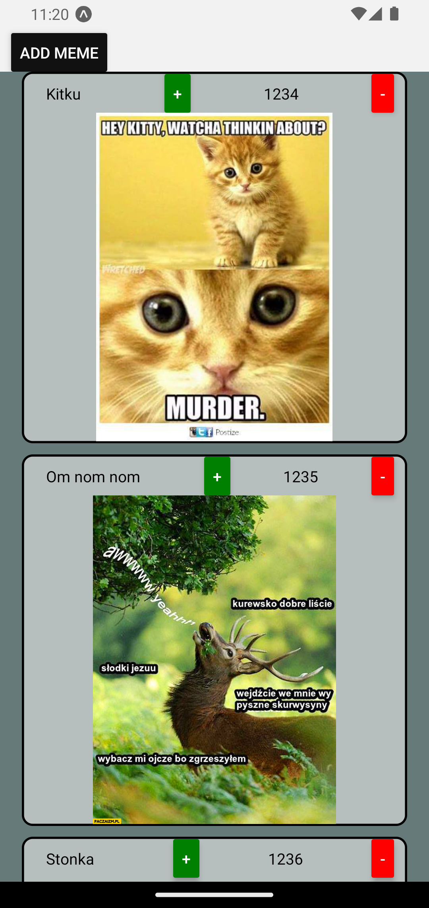

# Meme-scroller

Meme scroller is a simple app written during the learning of react-native and usage with Firebase.

App is a simple page for scrolong and up-/downvoting of memes.

An example view looks like this:

<p align="center"></p>

# Usage

In order to build and run an app:

1. Install Expo and Firebase CLI
2. Create a Firebase project with web-app
3. Change the Firebase project to blaze plan.
4. Add an `.env` file to the directory and paste firebase configuration from the firebase console to this file, like this:

```
API_KEY=...
AUTH_DOMAIN=...
PROJECT_ID=...
STORAGE_BUCKET=...
MESSAGING_SENDER_ID=...
APP_ID=...
MEASUREMENT_ID=...
```

5. Deploy Firebase cloud functions
6. Run an app
